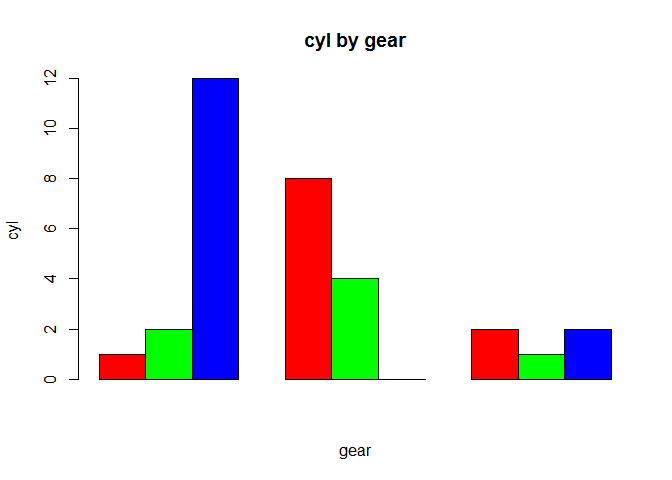
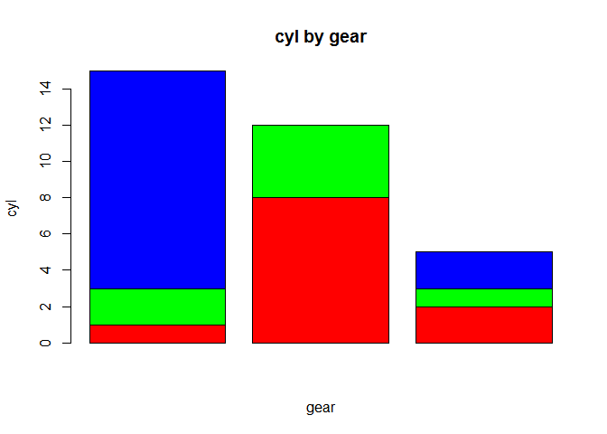
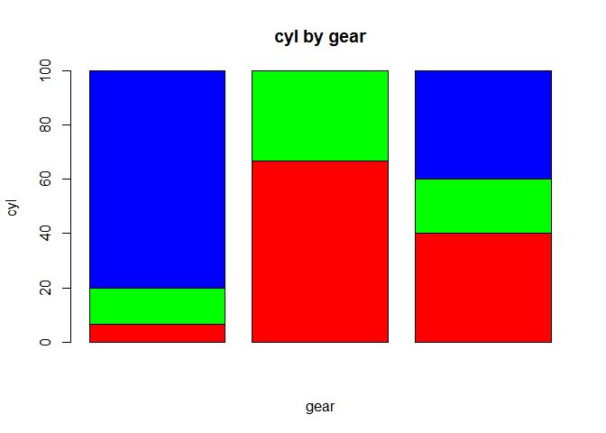
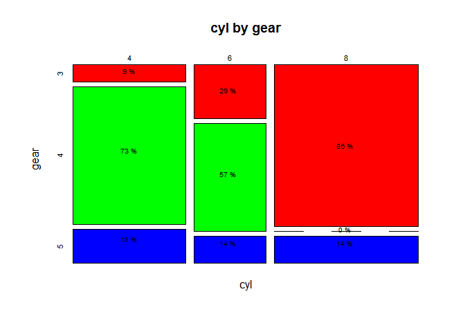

<!-- README.md is generated from README.Rmd. Please edit that file -->
descriptr
=========

[](https://cran.r-project.org/package=descriptr) [](https://travis-ci.org/rsquaredacademy/descriptr) [](https://ci.appveyor.com/project/rsquaredacademy/descriptr) [](https://codecov.io/github/rsquaredacademy/descriptr?branch=master)

Table of Contents
-----------------

-   [Overview](#overview)
-   [Installation](#installation)
-   [Usage](#usage)
    -   [Data Screening](#screener)
    -   [Descriptive Statistics](#descriptive)
    -   [Distributions](#distributions)
-   [Similar packages](#similar)
-   [Links](#links)

Overview
--------

The goal of descriptr is to ease the process of generating descriptive statistics and exploring statistical distributions.

Installation
------------

You can install descriptr from github with:

``` r
# install.packages("devtools")
devtools::install_github("rsquaredacademy/descriptr")
```

Usage
-----

### Data Screening

The `screener` function will screen a data set and return the following: - Column/Variable Names - Data Type - Levels (in case of categorical data) - Number of missing observations - % of missing observations

``` r
mt <- mtcars
mt[, c(2, 8:11)] <- lapply(mt[, c(2, 8:11)], factor)
mt[sample(1:nrow(mt), 12), sample(1:ncol(mt), 6)] <- NA
screener(mt)
#> -----------------------------------------------------------------------
#> |  Column Name  |  Data Type  |  Levels   |  Missing  |  Missing (%)  |
#> -----------------------------------------------------------------------
#> |      mpg      |   numeric   |    NA     |    12     |     37.5      |
#> |      cyl      |   factor    |   4 6 8   |    12     |     37.5      |
#> |     disp      |   numeric   |    NA     |     0     |       0       |
#> |      hp       |   numeric   |    NA     |    12     |     37.5      |
#> |     drat      |   numeric   |    NA     |    12     |     37.5      |
#> |      wt       |   numeric   |    NA     |     0     |       0       |
#> |     qsec      |   numeric   |    NA     |    12     |     37.5      |
#> |      vs       |   factor    |    0 1    |    12     |     37.5      |
#> |      am       |   factor    |    0 1    |     0     |       0       |
#> |     gear      |   factor    |   3 4 5   |     0     |       0       |
#> |     carb      |   factor    |1 2 3 4 6 8|     0     |       0       |
#> -----------------------------------------------------------------------
#> 
#>  Overall Missing Values           72 
#>  Percentage of Missing Values     20.45 %
#>  Rows with Missing Values         12 
#>  Columns With Missing Values      6
```

### Descriptive Statistics

The following functions are available for generating descriptive statistics:

-   `summary_stats`
-   `cross_table`
-   `freq_table`
-   `freq_cont`
-   `group_summary`
-   `oway_tables`
-   `tway_tables`

#### Summary Statistics

The `summary_stats` function returns a comprehensive set of statistics for **continuous** data.

``` r
summary_stats(mtcars$mpg)
#>                         Univariate Analysis                          
#> 
#>  N                       32.00      Variance                36.32 
#>  Missing                  0.00      Std Deviation            6.03 
#>  Mean                    20.09      Range                   23.50 
#>  Median                  19.20      Interquartile Range      7.38 
#>  Mode                    10.40      Uncorrected SS       14042.31 
#>  Trimmed Mean            19.95      Corrected SS          1126.05 
#>  Skewness                 0.67      Coeff Variation         30.00 
#>  Kurtosis                -0.02      Std Error Mean           1.07 
#> 
#>                               Quantiles                               
#> 
#>               Quantile                            Value                
#> 
#>              Max                                  33.90                
#>              99%                                  33.44                
#>              95%                                  30.09                
#>              90%                                  31.30                
#>              Q3                                   22.80                
#>              Median                               19.20                
#>              Q1                                   15.43                
#>              10%                                  14.34                
#>              5%                                   12.00                
#>              1%                                   10.40                
#>              Min                                  10.40                
#> 
#>                             Extreme Values                            
#> 
#>                 Low                                High                
#> 
#>   Obs                        Value       Obs                        Value 
#>   15                         10.4        20                         33.9  
#>   16                         10.4        18                         32.4  
#>   24                         13.3        19                         30.4  
#>    7                         14.3        28                         30.4  
#>   17                         14.7        26                         27.3
```

#### Cross Tabulation

The `cross_table` function creates two way tables of categorical variables. It is **not necessary** to coerce a variable to type `factor`.

``` r
cross_table(mtcars$cyl, mtcars$gear)
#>     Cell Contents
#>  |---------------|
#>  |     Frequency |
#>  |       Percent |
#>  |       Row Pct |
#>  |       Col Pct |
#>  |---------------|
#> 
#>  Total Observations:  32 
#> 
#> ----------------------------------------------------------------------------
#> |              |                           gear                            |
#> ----------------------------------------------------------------------------
#> |          cyl |            3 |            4 |            5 |    Row Total |
#> ----------------------------------------------------------------------------
#> |            4 |            1 |            8 |            2 |           11 |
#> |              |        0.031 |         0.25 |        0.062 |              |
#> |              |         0.09 |         0.73 |         0.18 |         0.34 |
#> |              |         0.07 |         0.67 |          0.4 |              |
#> ----------------------------------------------------------------------------
#> |            6 |            2 |            4 |            1 |            7 |
#> |              |        0.062 |        0.125 |        0.031 |              |
#> |              |         0.29 |         0.57 |         0.14 |         0.22 |
#> |              |         0.13 |         0.33 |          0.2 |              |
#> ----------------------------------------------------------------------------
#> |            8 |           12 |            0 |            2 |           14 |
#> |              |        0.375 |            0 |        0.062 |              |
#> |              |         0.86 |            0 |         0.14 |         0.44 |
#> |              |          0.8 |            0 |          0.4 |              |
#> ----------------------------------------------------------------------------
#> | Column Total |           15 |           12 |            5 |           32 |
#> |              |        0.468 |        0.375 |        0.155 |              |
#> ----------------------------------------------------------------------------
```

A plot method has been defined which will generate:

-   Grouped bar plots

``` r
k <- cross_table(mtcars$cyl, mtcars$gear)
plot(k, beside = TRUE)
```



-   Stacked bar plots

``` r
k <- cross_table(mtcars$cyl, mtcars$gear)
plot(k)
```



-   Proportional bar plots

``` r
k <- cross_table(mtcars$cyl, mtcars$gear)
plot(k, proportional = TRUE)
```



Mosaic plots can be created using the `mosaciplot` method.

``` r
k <- cross_table(mtcars$cyl, mtcars$gear)
mosaicplot(k)
```



### Explore Distributions

License
-------

MIT © [Aravind Hebbali](https://www.rsquaredacademy.com)
